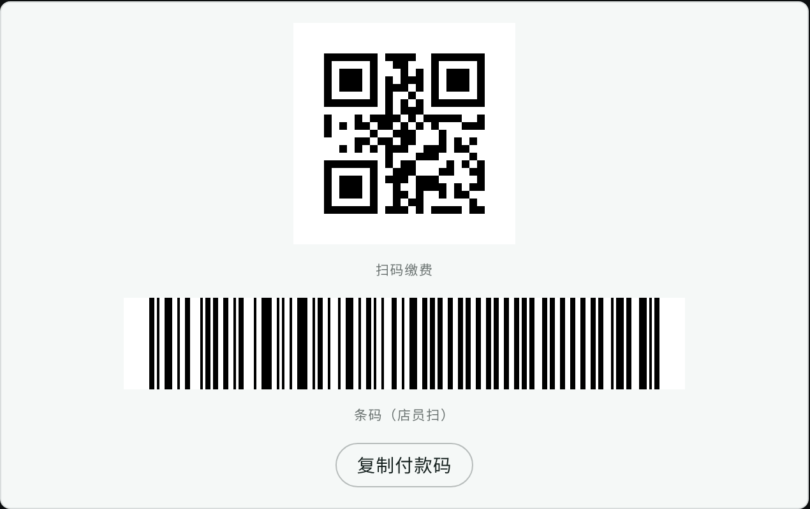

# dshagent — 智能客服系统

基于 DeepSeek Harness（deepseek-harness 源码）改造的 **Docker 化智能客服系统**：

- **Admin 端**：官方 DSH Web GUI —— 配置 AI 模型/provider、查看会话、管理知识库。
- **Guest 游客端**：纯聊天对话页 —— 匿名问答、自带限流；回答由知识库驱动并可
  渲染 Markdown / 表格 / 条形图 / 图片，客服可附带来源引用。
- **知识库**：Obsidian vault 目录只读挂载，编辑 vault 即更新客服知识。
- **部署**：Docker compose 单机运行（dsh-agent + nginx）；游客与 Admin 分占两个端口。

## 快速开始

```bash
cd customer-service/deploy
cp .env.example .env        # 填 AGENTROUTER_API_KEY
docker compose up -d --build
# 游客端 http://<host>:10800/    管理端 http://<host>:10801/
```

详见 [deploy/README.md](deploy/README.md)。

## 架构

```
               对外 nginx :10800 / :10801
            :10800 (游客)            :10801 (Admin)
                 │                        │
     Guest 前端(静态)             官方 DSH Web GUI
        │  /api/guest/*                 │
        ▼                              ▼
        └──────── dsh-agent :127.0.0.1:3080 ────────┘
          · 官方内核 bundle（dsh-base + dsh-web-app）
          · customer-service / customer-service-guest preset（瘦身工具集）
          · knowledge-search（vault 只读检索） · guest-server（匿名 API + 限流）
          · output-gate（输出前自审门禁：图形块先审后渲染）
          · /kb = Obsidian vault（只读）· DSH_HOME 卷（settings/sessions）
```

## 输出前自审门禁

回答中的图形围栏（`mermaid` / `chart` / `image` / `html`）在**送达访客之前**经过确定性校验，
不通过则**降级剥离** —— **绝不把坏图或原始围栏源码交给访客**。

- **分级门禁**：文字仍走流式；**图形块先审后渲染**（主机侧摘块 → 前端占位 → 真机判定 → 渲染或降级文案）；
- **不可绕过**：`/api/guest/chat`、`/chat/stream`、`/history` **三出口**均由主机侧同一门禁处理，
  不依赖提示词或前端自觉；**围栏源码不出现在任何载荷字段**；
- **职责分层**：主机侧做结构性判定；**只能真机判定**的项（空图/异常比例/`naturalWidth`）由访客端
  渲染后实测，结论经 `/api/guest/render-report` 回传留痕；
- **`passed` ≠ 真机已验证**：它只表示「对该访客保持可见」；真机证据的归属地是**留痕**；
- **不做模型重写**：本机制无二次生成、不回改已上屏内容，未通过即降级。

> **机制保证的口径**：**「出块时，坏内容不送达访客」**——**不是**「每次回答都会出图」。
> 真实模型出图率**不稳定**（实测约 60%），拒答多发生在提问笼统或知识库未命中时。

**生效条件（须按实际挂载判定）**：`web/guest/**` 经 bind-mount **改文件即生效**；
`plugins/**`、`presets/**`、`deploy/profile/**` **须重建镜像**才生效（仅重启无效）。
`serviceVersion` 是**镜像构建戳**——改源码值不等于生效。

完整交付材料（含已知权衡、未验证项、回滚路径）见
[docs/output-self-review-delivery.md](docs/output-self-review-delivery.md)。

## 访客对话

- **一问一答**：会话日志里每个 agent step 各写一条 `assistant/message`（模型先写一句过渡语
  并发起工具调用，拿到结果再写正式回答），但访客界面把整轮当一段文字。`/history` 归并
  **同一 turn** 的各 step、丢弃**没有访客提问的 turn**，因此刷新后是一问一答，断流恢复也
  不会把过渡语当成最终答复。旧记录无需迁移即可恢复。
- **缴费付款码**：账单查询用 `level=5` 取回 `barcode`。模型把付款码放进 ` ```barcode ` 围栏，
  前端渲染成一张卡片：**二维码 + Code128 一维条码 + 一键复制**，数字同时留在正文里。
  - 为什么两个码图都给：账单接口的字段名是 `barcode`（账单上印的是一维条码），而缴费入口
    （微信／支付宝一类的扫码）通常按二维码识别。两个码图内容同源，访客截哪个能被认就用哪个。
  - 二维码用随页面部署的 `qrcode-generator`（MIT，与 mermaid 同一套懒加载形态）；库不可用时
    只少一个码图，条码与数字照常——库缺失不该让访客拿不到付款码。
  - 识别不问模型：` ```barcode ` 围栏、行内代码、句子里直接写数字三种形态都会出卡片。
  - 判据是**真的解一次**而不是「图出来了」：一维条码按 Code128 反解、二维码交给独立解码器
    jsQR 解，两者都必须解出**业务系统接口当前返回的**付款码（期望值现取，不写死）——
    编码错了不会报错，只会让访客缴错费（`web/guest/tests/paycode-check.mjs`）。

  

## 目录

- `design.md` — 改造设计（裁剪清单 / 架构 / 验收标准）
- `presets/` — Admin 客服 preset 与游客瘦身 preset
- `plugins/` — knowledge-search 检索插件、guest-server 游客 API 桥、output-gate 输出前自审门禁
- `web/guest/` — 游客前端（单文件 HTML）
- `deploy/` — Dockerfile / compose / nginx / profile / 部署说明
- `docs/` — 契约、需求、验证报告与最终交付事实汇总

## 裁剪说明

客服 profile 只装载官方纯净内核（`@deepseek-ai/dsh-base` + `@deepseek-ai/dsh-web-app`），
不装任何第三方业务 bundle（agiteam / 任务板 / 团队编排 / Office / PPT / 搜索等，
见 [design.md](design.md) 的裁剪清单）。第三方代码保留在仓库中但不由客服
profile 装载，避免攻击面与维护负担。
